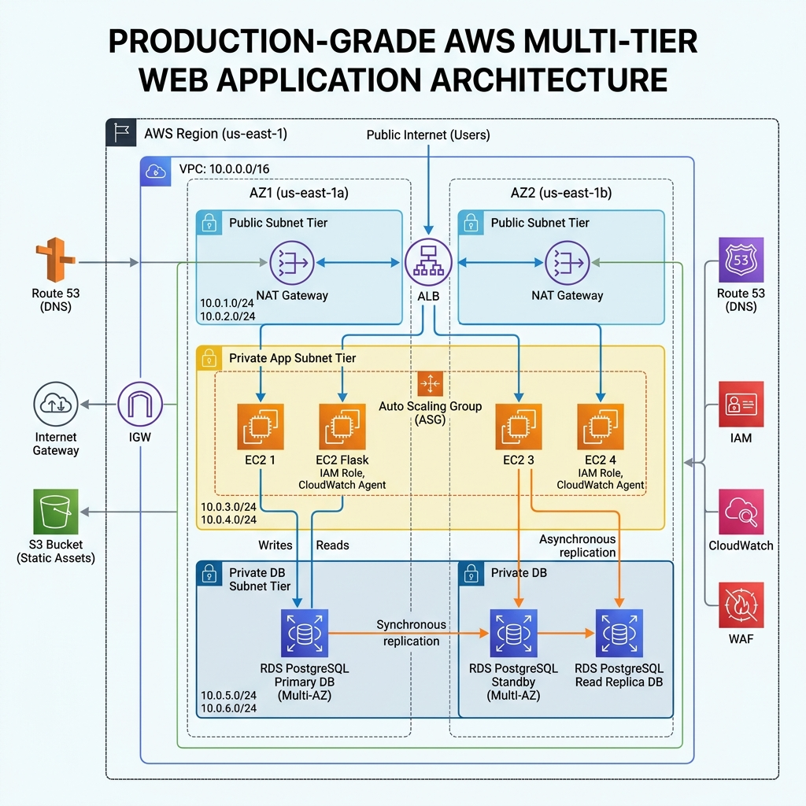

# Production-Grade AWS Flask Infrastructure (Multi-Tier Architecture)

A professional, production-ready, modular AWS infrastructure engineered in Terraform. This project provisions a high-availability, secure, and autoscaling multi-tier Flask application integrated with an Amazon RDS PostgreSQL cluster featuring a Primary DB and a Read Replica DB, enforcing strict transit encryption (SSL/TLS) and isolated VPC networks.

---

## 🏗️ Architecture Design

The system implements the **AWS Well-Architected Framework** security and reliability pillars using three isolated network tiers (Public, Private Application, Private Database) spanning multiple Availability Zones.

### System Architecture Diagram



### Key Architectural Pillars

1. **Network Segregation & Security**:
   - **Public Subnets**: Host only the Application Load Balancer (ALB) and the NAT Gateway. No EC2 instances or databases are exposed directly.
   - **Private Application Subnets**: Host the Auto Scaling Group (ASG) EC2 instances. Outbound internet connection is limited through the NAT Gateway for package updates and asset downloading. Direct ingress from the internet is blocked.
   - **Private Database Subnets**: Completely isolated database subnets with no route to the internet or NAT Gateway. They only accept ingress PostgreSQL connections from the application servers.

2. **Elastic Scaling & High Availability**:
   - **Application Load Balancer**: Distributes incoming HTTP requests to healthy targets in the ASG.
   - **Auto Scaling Group**: Maintains a minimum of 2 instances running in separate availability zones (AZs) for fault tolerance. Standard health check grace period (`900s`) and rolling instance refresh preferences safeguard continuous deployment.
   - **Multi-AZ RDS Primary DB**: Provides synchronous replication to a standby instance in a different AZ, enabling automatic failover without manual intervention.

3. **Read Replica Query Offloading**:
   - Write transactions (creating inventory items, logging audits) are routed directly to the Primary DB.
   - Heavy aggregate and analytical reporting queries are offloaded to the PostgreSQL Read Replica DB to protect the performance of the transaction engine.

4. **SSL/TLS Encryption-in-Transit**:
   - The RDS Parameter Group enforces SSL (`rds.force_ssl = 1`) on all database connection attempts.
   - The Flask app establishes encrypted connections using Pycopg2 with `sslmode=require`.

5. **S3-Driven Instance Bootstrapping**:
   - Application source code (`app.py`, `requirements.txt`, template layout) is stored in a private S3 bucket.
   - An EC2 Instance Profile with read-only S3 access allows the instances to securely pull the deployment assets during user data bootstrap execution.

---

## 📁 Repository Directory Structure

```text
task4/
├── app/                        # Flask Web Application Codebase
│   ├── app.py                  # Core application routing & database handler
│   ├── requirements.txt        # Python package requirements (Flask, psycopg2-binary, gunicorn)
│   └── templates/
│       └── index.html          # Responsive Bootstrap dashboard UI
├── modules/                    # Reusable Infrastructure Modules
│   ├── vpc/                    # Multi-AZ VPC network module
│   ├── security_groups/        # Least-privilege network firewalls module
│   ├── alb/                    # Public Application Load Balancer module
│   ├── rds/                    # PostgreSQL Primary + Read Replica module
│   └── asg/                    # Auto Scaling Launch Template & Group module
├── tests/
│   └── integration_test.py     # Automated E2E integration test suite
├── main.tf                     # Root Terraform module instantiation
├── outputs.tf                  # Root outputs (ALB DNS name, DB endpoints)
├── providers.tf                # Provider locks (AWS, random)
├── variables.tf                # Root customizable variables
└── README.md                   # Technical documentation
```

---

## 🔧 Module Inputs and Outputs

Detailed specifications for each of the core Terraform modules:

### 1. VPC Module (`./modules/vpc`)
- **Inputs**:
  - `vpc_cidr` (`string`): The CIDR network block for the VPC.
  - `availability_zones` (`list(string)`): AZs to distribute subnets.
  - `public_subnet_cidrs` (`list(string)`): CIDR blocks for ingress subnets.
  - `private_app_subnet_cidrs` (`list(string)`): CIDR blocks for EC2 instances.
  - `private_db_subnet_cidrs` (`list(string)`): CIDR blocks for RDS DB instances.
- **Outputs**:
  - `vpc_id`: Root VPC ID.
  - `public_subnet_ids`: Public subnet resource IDs.
  - `private_app_subnet_ids`: Private App subnet resource IDs.
  - `private_db_subnet_ids`: Private Database subnet resource IDs.

### 2. Security Groups Module (`./modules/security_groups`)
- **Inputs**:
  - `vpc_id` (`string`): Target VPC ID.
- **Outputs**:
  - `alb_sg_id`: ALB Security Group (Allows Port 80 ingress from `0.0.0.0/0`).
  - `app_sg_id`: App Security Group (Allows Port 5000 ingress from ALB SG only).
  - `db_sg_id`: DB Security Group (Allows Port 5432 ingress from App SG only).

### 3. RDS Module (`./modules/rds`)
- **Inputs**:
  - `private_db_subnet_ids` (`list(string)`): Target database subnets.
  - `db_security_group_id` (`string`): Security group enforcing ingress rules.
  - `db_name` / `db_username` / `db_password` / `db_instance_class`.
- **Outputs**:
  - `primary_address` / `primary_endpoint`: Primary connection parameters.
  - `replica_address` / `replica_endpoint`: Replica connection parameters.

### 4. ALB Module (`./modules/alb`)
- **Inputs**:
  - `vpc_id` (`string`): Target VPC ID.
  - `public_subnet_ids` (`list(string)`): Target public subnets.
  - `alb_security_group_id` (`string`): ALB security group ID.
- **Outputs**:
  - `alb_dns_name`: Public DNS address of the Load Balancer.
  - `target_group_arn`: Reference to the HTTP Target Group.

### 5. ASG Module (`./modules/asg`)
- **Inputs**:
  - `private_app_subnet_ids` (`list(string)`): Target application subnets.
  - `app_security_group_id` (`string`): App instances security group.
  - `target_group_arn` (`string`): ALB destination target group.
  - `db_primary_endpoint` / `db_replica_endpoint` / credentials.
  - `app_bucket_name` / `app_bucket_arn`: Deployment bucket credentials.
- **Outputs**:
  - `asg_name`: Auto Scaling Group name.

---

## 🚀 Deployment Instructions

### 1. Prerequisites
- Install **Terraform** (>= v1.0.0).
- Install **Python 3** and `requests` library.
- Configure AWS local credentials with sufficient permissions (IAM Administrator is recommended).

### 2. Initialization & Plan
Initialize the provider plugins and modules:
```bash
terraform init
```

Generate the execution plan to verify resources to be created:
```bash
terraform plan -out=tfplan
```

### 3. Provision Infrastructure
Apply the execution plan to AWS:
```bash
terraform apply tfplan
```
*Note: Provisioning takes about 15-20 minutes, primarily due to the creation of the Multi-AZ RDS primary database and the Read Replica.*

Upon successful deployment, Terraform will output the following variables:
- `alb_dns_name`: The load balancer address (e.g. `production-alb-1020183891.us-east-1.elb.amazonaws.com`).
- `db_primary_endpoint`: The primary RDS DB address.
- `db_replica_endpoint`: The replica RDS DB address.

---

## 🧪 Verification & Testing

### Automated E2E Testing

The project includes an integration script `tests/integration_test.py` that validates the live infrastructure components.

To run the automated tests, execute:
```bash
python3 tests/integration_test.py <alb_dns_name>
```

#### Test Phases Executed:
1. **Health Verification**: Polls `/health` until EC2 user data completes execution and returns status `healthy`.
2. **SSL and DB Connections**: Calls `/api/db-status` to assert both primary and replica DB nodes are configured and enforcing SSL/TLS in-transit.
3. **Primary Read Validation**: Requests `/api/items` to fetch initial records from the Primary DB.
4. **Primary Write Validation**: Issues a POST request to `/api/items` creating a test router, verifying transactional writes.
5. **Replica Sync & Reporting**: Calls `/api/report` to query aggregates (joined record details) from the Read Replica DB.

### Manual Verification in Web Browser
You can test the full functionality by opening the Load Balancer DNS name in your browser:
```text
http://<alb_dns_name>
```

Through the UI dashboard, you can:
- View the active inventory items.
- Check the active connection details (Active SSL, Host Endpoint, SSL Version, Cipher suite) for both Primary and Replica DB nodes.
- Submit new items using the inventory creation form.
- View the analytics reports generated directly from the Read Replica.

---

## 🧹 Cleanup Instructions

To tear down all provisioned resources and prevent ongoing billing, run:
```bash
terraform destroy -auto-approve
```
*Note: `force_destroy` is enabled on the S3 bucket to clean up objects during resource destruction automatically.*
